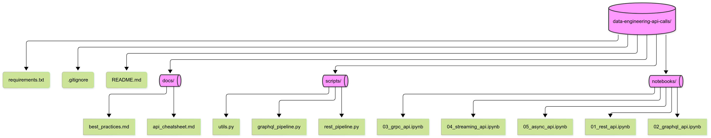

## 📷 Project Overview

------

## 🔹 README.md 

---

#### 📂 Repository Structure
- **notebooks/** → Jupyter Notebooks for experimentation and learning
- **scripts/** → Python scripts for production-ready API calls
- **docs/** → Additional notes, best practices, and cheatsheets
- **requirements.txt** → Python dependencies

---

#### 🚀 API Methods Covered
1. **REST API** → Most common, JSON/XML, simple HTTP requests
2. **GraphQL API** → Flexible queries, single endpoint
3. **gRPC** → High-performance, binary, great for microservices
4. **SOAP API** → Legacy but secure, XML-based
5. **Streaming APIs** → Real-time data with WebSockets, Kafka, Spark Streaming
6. **Asynchronous APIs** → Long-running tasks with job IDs and callbacks
7. **Batch API Calls** → Efficient bulk data retrieval

---

#### 🔧 Installation
```bash
git clone https://github.com/your-username/data-engineering-api-calls.git
cd data-engineering-api-calls
pip install -r requirements.txt
```

------

## 📘 Examples

### REST API

```
import requests

url = "https://api.example.com/data"
headers = {"Authorization": "Bearer YOUR_API_KEY"}

response = requests.get(url, headers=headers)

if response.status_code == 200:
    data = response.json()
    print(data)
else:
    print(f"Error {response.status_code}: {response.text}")
```

### GraphQL API

```
import requests

url = "https://api.example.com/graphql"
query = """
{
  user(id: "1") {
    name
    email
  }
}
"""

response = requests.post(url, json={"query": query})
print(response.json())
```

------

## 📌 Next Steps

- Integrate these API methods into ETL pipelines (Airflow/Prefect).
- Store API data into **Data Lake (S3, HDFS)** or **Data Warehouse (BigQuery, Snowflake)**.
- Add logging, error handling, and retry mechanisms.

------

## 🔹 Best Practices for GitHub Organization
- Use **clear commit messages**:  
  `git commit -m "Added REST API notebook with authentication example"`
- Write **documentation in English** (`docs/api_cheatsheet.md` for quick notes).  
- Use **Jupyter Notebooks for experiments** and **Python scripts for production code**.  
- Add a **requirements.txt** or `pyproject.toml` for dependencies.  
## 🔹 Repository Structure 

```
data-engineering-api-calls/
│── README.md
│── notebooks/
│    ├── 01_rest_api.ipynb
│    ├── 02_graphql_api.ipynb
│    ├── 03_grpc_api.ipynb
│    ├── 04_streaming_api.ipynb
│    └── 05_async_api.ipynb
│── scripts/
│    ├── rest_pipeline.py
│    ├── graphql_pipeline.py
│    └── utils.py
│── requirements.txt
│── docs/
│    ├── api_cheatsheet.md
│    └── best_practices.md
│── .gitignore
```


- Keep **API keys/secrets** in `.env` files and add the# Api_Calling_pro

